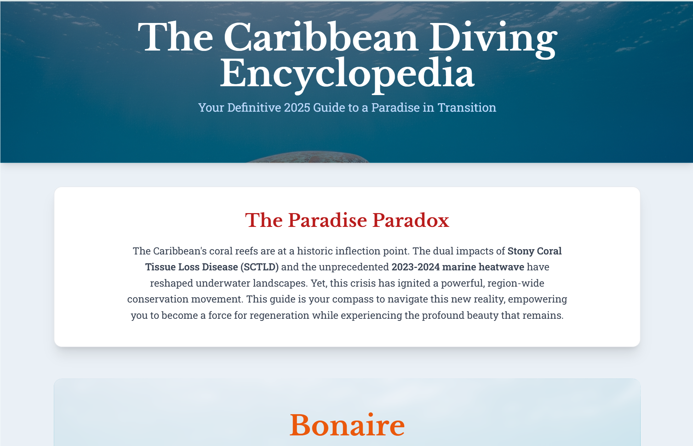

# The Caribbean Diving Encyclopedia 2025



An interactive, in-depth guide to Caribbean scuba diving in 2025. This project serves as a public case study in building a complete web application using a proprietary, multi-agent AI swarm.

**Live Site:** [https://joshtol.github.io/caribbean-diving-guide-2025/](https://joshtol.github.io/caribbean-diving-guide-2025/)

---

### About This Project

This project was developed to be both a functional travel guide and a transparent showcase of a sophisticated human-AI development workflow. As an AI engineer and not a scuba diver myself, I built this guide to rigorously test my proprietary AI agent swarm, including its hallucination filtering protocols and high-velocity development capabilities.

The AI-driven development cycle was fueled by a suite of cutting-edge tools, including **Gemini CLI, Google Code Assist, Charm CRUSH CLI Agent, OpenRouter, and custom agents (e.g., Qwen3 Coder)**. All AI-generated information was then validated for accuracy by a human subject matter expert (my lovely girlfriend), an experienced diver who has personally visited several of these locations.

This repository demonstrates a workflow where an AI swarm, operating under a constitutional framework, can produce accurate, expert-level content guided by a non-expert and verified by an expert.

### Features

* **Responsive Design:** Mobile-first design that looks great on all devices.
* **AI-Generated Content:** In-depth, AI-researched content on 6 major Caribbean diving destinations.
* **SEO Optimized:** Includes comprehensive metadata and Schema.org structured data.
* **Modern Tech Stack:** Built with HTML5 and Tailwind CSS.

### The Development Process: An Agentic Swarm Workflow

This repository showcases a "high-velocity" development workflow governed by the principles in my operational constitution. The process involved:

* **Automated Research:** The AI swarm utilized an automated research system (`wild-research/`) to synthesize the latest ecological and travel data.
* **Constitutional Safeguards:** All actions were governed by a multi-layered defense system to ensure safety, efficiency, and alignment with user intent.
* **Autonomous Reasoning & Improvement (ARI) Loop:** The agents operated on a continuous cycle of orienting (researching their knowledge base), acting (executing tools), observing results, and reflecting (self-correction and verification).
* **End-to-End Execution:** The swarm handled the entire development process, from initial research and content generation to coding, image generation, and preparing the repository for deployment.

### How to Run Locally

1.  Clone the repository:
    ```bash
    git clone [https://github.com/joshtol/caribbean-diving-guide-2025.git](https://github.com/joshtol/caribbean-diving-guide-2025.git)
    ```
2.  Navigate to the project directory:
    ```bash
    cd caribbean-diving-guide-2025
    ```
3.  To view the project correctly with images, you must run it from a local server. If you are using VS Code, the easiest way is with the **Live Server** extension.
    * Install the "Live Server" extension from the VS Code Marketplace.
    * Click the "Go Live" button in the bottom-right corner of the editor.

---

Created by **joshtol** using a proprietary AI agent swarm.
